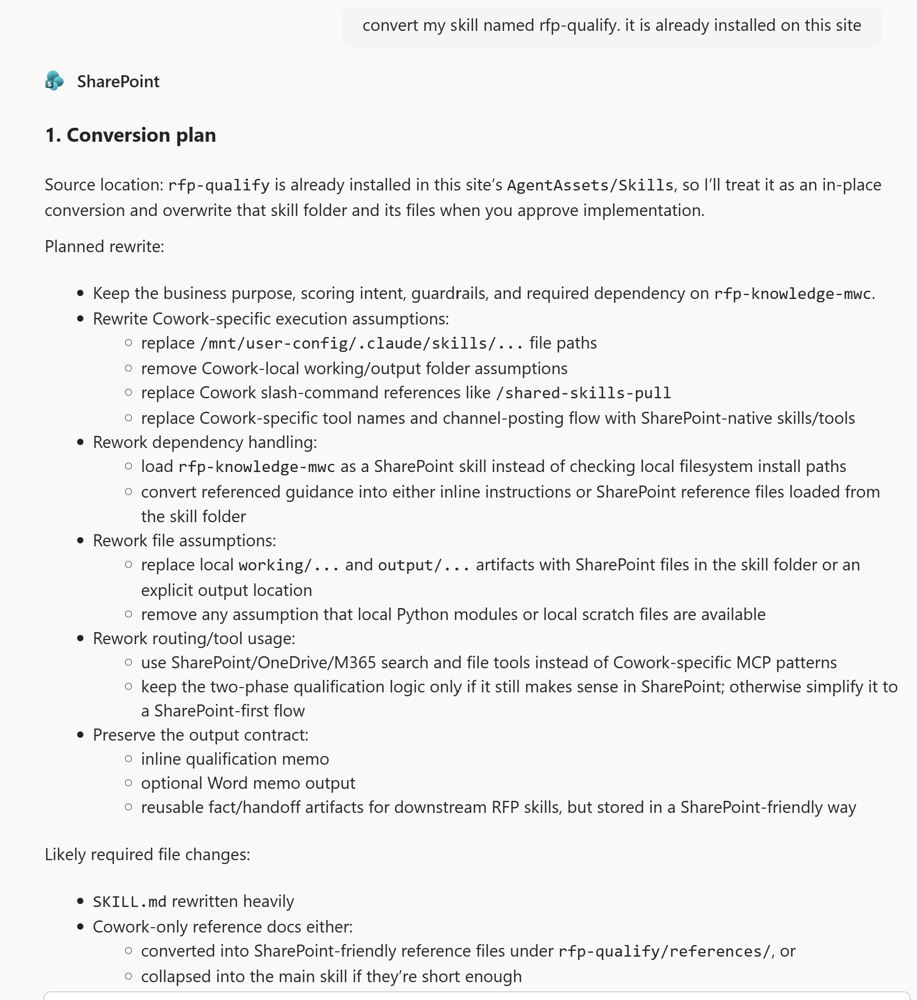

# Convert Cowork Skill to SharePoint

This skill helps convert an existing Copilot Cowork skill into a Copilot in SharePoint skill.

It reviews the source skill, identifies Cowork-specific assumptions, prepares a SharePoint-native conversion plan, waits for user approval, then creates or updates the converted skill in `AgentAssets/Skills`.

## What you get

- A SharePoint-ready SKILL.md converted from an existing Cowork skill.
- A clear conversion plan before anything is changed.
- Rewritten or restructured supporting files, when needed.
- A change report explaining routing, storage, dependency, and file-structure updates.
- A deprecated-file list showing old supporting files that can be reviewed for deletion.

### What it does

- Reads an existing Cowork `SKILL.md` and related supporting files
- Identifies unsupported Cowork assumptions, tools, paths, and runtime behaviors
- Produces a conversion plan before making changes
- Rewrites `SKILL.md` for Copilot in SharePoint
- Rewrites or restructures supporting files into SharePoint-friendly folders such as:
  - `references/`
  - `examples/`
  - `eval/`
  - `scripts/`
- Flags deprecated supporting files that may be deleted after review
- Verifies saved files after update when practical

### Example prompts

To use this skill in Copilot for SharePoint, say:

- “Convert my skill”
- “Rewrite my Cowork skill”
- “Make my Cowork skill work in SharePoint”
- “Adapt this Cowork skill for Copilot in SharePoint”
- “Port this skill from Cowork to SharePoint”

### Safety model

The skill is intentionally approval-first.

It does **not** overwrite, create, rename, replace, or deprecate files until the user approves the conversion plan.

It also does **not** delete deprecated supporting files automatically. Instead, it lists them in the final output so the user can review and delete them manually if desired.

### Intended use

This is useful for teams migrating reusable Copilot Cowork skills into Copilot in SharePoint, especially when those skills contain assumptions about local files, Cowork-specific tools, unsupported runtime behavior, or non-SharePoint storage.

### Notes

This skill is not intended for creating a brand-new skill from scratch. If there is no existing Cowork skill or Cowork pattern to migrate, use a skill-creation workflow instead.

## SharePoint Skill

| Solution | Author(s) |
| --- | --- |
| convert-cowork-skill-to-sharepoint | Jim Duncan &#124; [GitHub](https://github.com/sparkitect) &#124; [LinkedIn](https://www.linkedin.com/in/sparchitect/) |

## Version history

| Version | Date | Comments |
| --- | --- | --- |
| 1.0 | June 2026 | Initial Release |

## Disclaimer

**THIS CODE IS PROVIDED _AS IS_ WITHOUT WARRANTY OF ANY KIND, EITHER EXPRESS OR IMPLIED, INCLUDING ANY IMPLIED WARRANTIES OF FITNESS FOR A PARTICULAR PURPOSE, MERCHANTABILITY, OR NON-INFRINGEMENT.**

