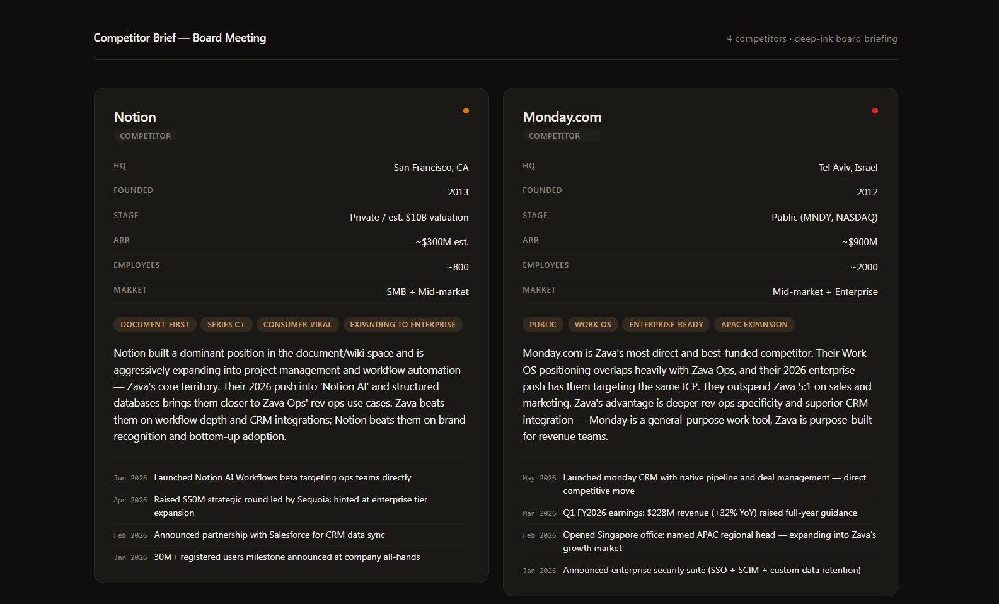

# Dossier

Renders a polished, self-contained HTML briefing from any data source — SharePoint lists, uploaded documents, or a verbal description. Automatically chooses between a responsive card grid (2–8 subjects) and a full one-pager briefing (1 subject).

## What you get

- A complete, self-contained HTML briefing with structured key facts, tags, prose summary, and an activity timeline per subject
- Auto-detection of layout: grid mode for 2–8 subjects, one-pager mode for a single detailed briefing
- A CSS-based activity timeline — no JavaScript required for rendering
- Four visual palette options; defaults to warm paper

## When to use

Ask Copilot:

- *"competitor landscape"* / *"account brief"* / *"candidate summary"*
- *"board bios"* / *"speaker profiles"* / *"partner overview"*
- *"briefing on these vendors"* / *"site inventory"* / *"dossier on..."*

## SharePoint Skill

| Solution | Author(s) |
| --- | --- |
| dossier | Zach Rosenfield &#124; [GitHub](https://github.com/zrosenfield) &#124; [LinkedIn](https://www.linkedin.com/in/zrosenfield/) |

## Version history

| Version | Date | Comments |
| --- | --- | --- |
| 1.0 | May 2026 | Initial Release |

## Disclaimer

**THIS CODE IS PROVIDED _AS IS_ WITHOUT WARRANTY OF ANY KIND, EITHER EXPRESS OR IMPLIED, INCLUDING ANY IMPLIED WARRANTIES OF FITNESS FOR A PARTICULAR PURPOSE, MERCHANTABILITY, OR NON-INFRINGEMENT.**

