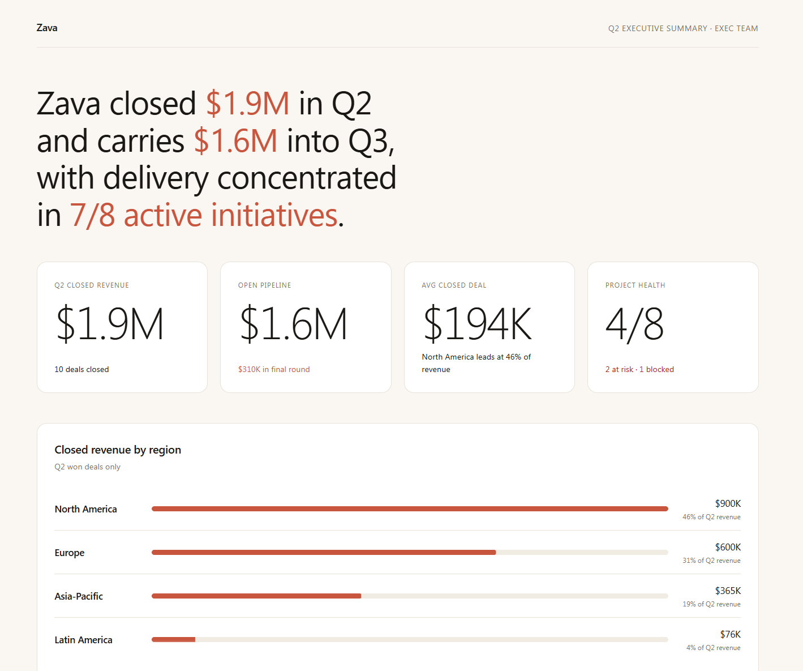

# Exec Report

Generates a polished, self-contained HTML executive report or dashboard from any data source — SharePoint lists, CSV exports, or a verbal description. Interviews the user, constructs a validated JSON document, then renders it into a single sandbox-safe HTML file with no external dependencies.

## What you get

- A complete, self-contained HTML executive report with a chosen narrative structure: Achievement, Problem, or Status
- A component library covering KPI cards, trend charts, bar breakdowns, comparison panels, status grids, data tables, and narrative highlights
- Four visual palette options: warm paper (cream/terra-cotta), deep ink (dark/gold), clean white (white/green), and slate (gray/blue)
- A sandbox-safe file with all JavaScript inline — no CDN links, no external dependencies, works inside a SharePoint iframe

## When to use

Ask Copilot:

- *"build an exec report"* / *"create a one-pager"* / *"make a status dashboard"*
- *"business review for Q2"* / *"project summary page"* / *"generate a visual report"*
- *"here's my SharePoint list data, build a report"* / *"summarize this CSV into a report"*

## SharePoint Skill

| Solution | Author(s) |
| --- | --- |
| exec-report | Zach Rosenfield &#124; [GitHub](https://github.com/zrosenfield) &#124; [LinkedIn](https://www.linkedin.com/in/zrosenfield/) |

## Version history

| Version | Date | Comments |
| --- | --- | --- |
| 1.0 | May 2026 | Initial Release |

## Disclaimer

**THIS CODE IS PROVIDED _AS IS_ WITHOUT WARRANTY OF ANY KIND, EITHER EXPRESS OR IMPLIED, INCLUDING ANY IMPLIED WARRANTIES OF FITNESS FOR A PARTICULAR PURPOSE, MERCHANTABILITY, OR NON-INFRINGEMENT.**

