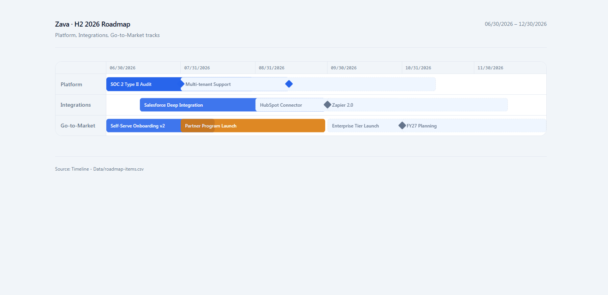

# Roadmap Timeline

Generates a polished, self-contained HTML roadmap or milestone timeline from any project data — SharePoint lists, pasted tables, or a verbal description. Automatically chooses between a horizontal swimlane roadmap (for phase-range data) or a vertical milestone list (for point-in-time events).

## What you get

- A complete, self-contained HTML visualization in one of two layouts: horizontal swimlane roadmap or vertical milestone timeline
- Percentage-based layout pre-computed directly in the HTML — no JavaScript required for positioning
- A today-line overlay (roadmap mode), status-colored phase blocks, and milestone diamonds
- Four visual palette options; defaults to slate for roadmaps and warm paper for milestone lists

## When to use

Ask Copilot:

- *"build a roadmap"* / *"create a timeline"* / *"show the project phases"*
- *"migration plan"* / *"release schedule"* / *"onboarding sequence"*
- *"show milestones"* / *"run of show"* / *"gantt chart"*

## SharePoint Skill

| Solution | Author(s) |
| --- | --- |
| roadmap-timeline | Zach Rosenfield &#124; [GitHub](https://github.com/zrosenfield) &#124; [LinkedIn](https://www.linkedin.com/in/zrosenfield/) |

## Version history

| Version | Date | Comments |
| --- | --- | --- |
| 1.0 | May 2026 | Initial Release |

## Disclaimer

**THIS CODE IS PROVIDED _AS IS_ WITHOUT WARRANTY OF ANY KIND, EITHER EXPRESS OR IMPLIED, INCLUDING ANY IMPLIED WARRANTIES OF FITNESS FOR A PARTICULAR PURPOSE, MERCHANTABILITY, OR NON-INFRINGEMENT.**

