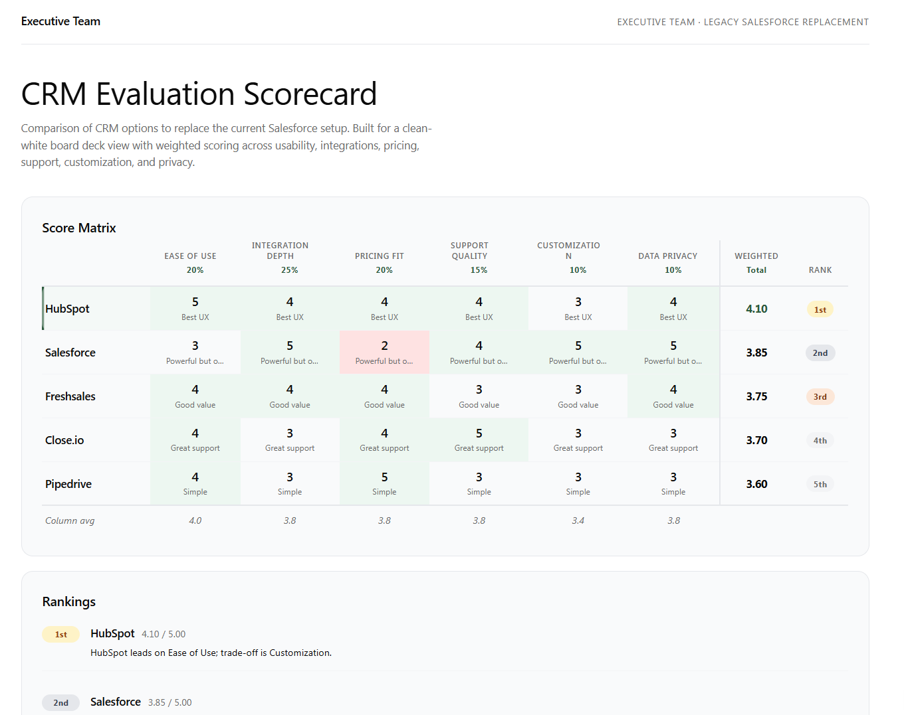

# Scorecard Matrix

Generates a polished, self-contained HTML heatmap scorecard — a weighted comparison matrix where entities (rows) are scored across dimensions (columns), with computed totals, rank badges, and a winner highlight. Used for vendor evaluation, tool assessment, candidate scoring, and any weighted multi-criteria ranking.

## What you get

- A complete, self-contained HTML heatmap scorecard with weighted scores, computed totals, and gold/silver/bronze rank badges
- Pre-computed heatmap cell backgrounds (low/mid/high tiers) embedded directly as inline styles — no JavaScript required for coloring
- A winner-row highlight, a column averages row, and a rankings callout section
- Four visual palette options; defaults to warm paper

## When to use

Ask Copilot:

- *"scorecard"* / *"comparison matrix"* / *"decision matrix"*
- *"vendor evaluation"* / *"tool assessment"* / *"candidate scoring"*
- *"which option is best"* / *"rank these options"* / *"weighted comparison"*

## SharePoint Skill

| Solution | Author(s) |
| --- | --- |
| scorecard-matrix | Zach Rosenfield &#124; [GitHub](https://github.com/zrosenfield) &#124; [LinkedIn](https://www.linkedin.com/in/zrosenfield/) |

## Version history

| Version | Date | Comments |
| --- | --- | --- |
| 1.0 | May 2026 | Initial Release |

## Disclaimer

**THIS CODE IS PROVIDED _AS IS_ WITHOUT WARRANTY OF ANY KIND, EITHER EXPRESS OR IMPLIED, INCLUDING ANY IMPLIED WARRANTIES OF FITNESS FOR A PARTICULAR PURPOSE, MERCHANTABILITY, OR NON-INFRINGEMENT.**

